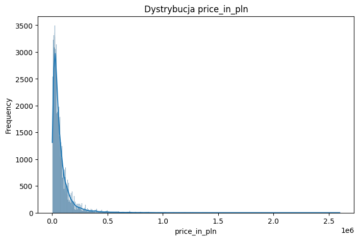
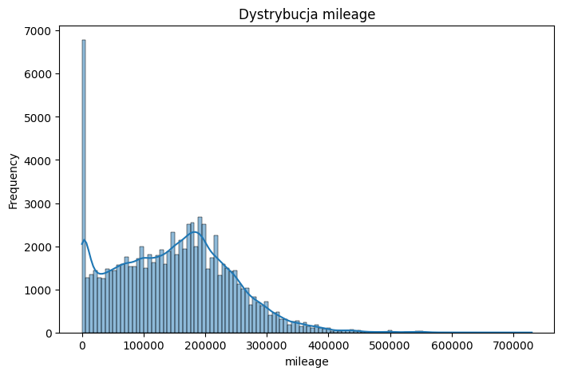
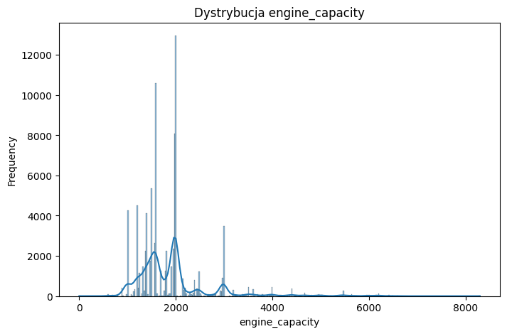
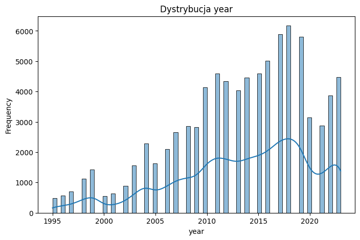
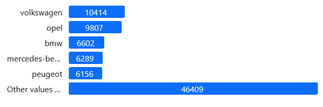
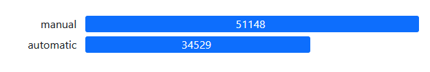
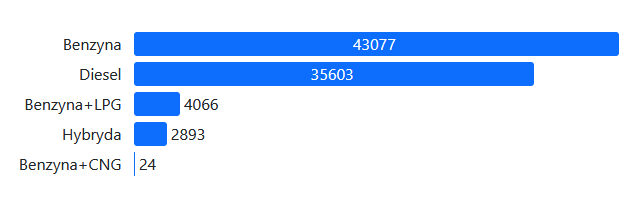
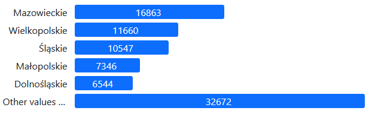
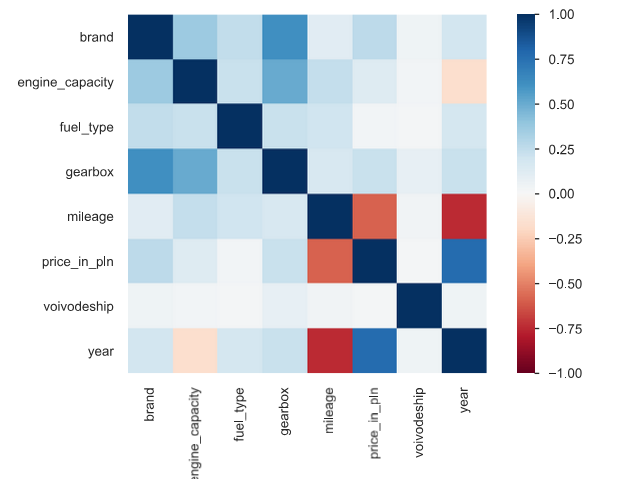

# s22393_CarPricePrediction
## Cel projektu
Celem projektu jest stworzenie modelu pozwalającego na przewidywanie ceny używanego samochodu na podstawie podanych prametrów.

Dataset zawiera ponad 90,000 rekordów ofert sprzedaży z popularnej strony z aukcjami samochodów.

Źródło danych: https://www.kaggle.com/datasets/wspirat/poland-used-cars-offers

## Analiza danych

Dataset zawiera 10 kolumn i 91523 wierszy, nie posiada brakujących wartości.
Do wygenerowania automatycznego raportu użyto pakietu pandas profling (ydata-profiling)
### Kolumny

| Nazwa | Opis | Przykład |
| ----- | ----- | ------- |
| brand | marka samochodu | alfa-romeo |
| model | nazwa konkretnego modelu | Alfa Romeo Spider 2.0-16 TSpark |
| price_in_pln | cena w PLN | 14700.0 |
| mileage | przebieg w kilometrach | 133 760 km |
| gearbox | rodzaj skrzyni biegów | manual |
| engine_capacity | pojemność silnika w cm3 | 1 970 cm3	 |
| fuel_type | rodzaj paliwa | Benzyna |
| city | miejscowość wystawienia oferty | Łask |
| voivodeship | województwo | Łódzkie |
| year | rok produkcji | 1998 |

4 kolumny to kolumny numeryczne – price_in_pln, mileage, engine_capacity, year.
2 kolumny to kolumny tekstowe – model, city
4 kolumny to kolumny kategoryczne – brand, gearbox, fuel_type, voivodship

Po wstępnym formatowaniu kolumn okazało się że dataset zawiera wiersze w których dane w poszczególnych kolumnach są pomieszane. Po ich usunięciu zostało 85677 wierszy.

Niektóre wartości w kolumnie voivodeship były nieprawidłowe. Po usunięciu wierszy zostało 85632 rekordów.
### Analiza zmiennych
- price_in_pln – ceny wahają się od 1111 do 2 599 000. Mediana to 46 500, ponad 75% cen jest poniżej 100 000 złotych.

  
- mileage – średni przebieg to 147 002 km, dużo wartości (ponad 6000) poniżej 10 czyli samochody nowe

  
- engine_capacity – średnia to 1893. Ponad 75% to silniki poniżej 2 litrów.

  
- year – średnia to 2013

  
- brand – 43 unikalne wartości
  
  
- model – 18021 unikalnych wartości

  
- gearbox

  
- fuel_type – 6 unikalnych wartości, wyraźna większośc to benzyna lub diesel

  
- city – 4353 unikalnych wartości, najpopularniejsze to duze miasta wojewódzkie jak Warszawa, Kraków czy Wrocław

  
- voivodship - 16 unikalnych wartości

  

### Macierz korelacji

Największy wpływ na cenę samochodu mają przebieg i rok produkcji.

Marka samochodu ma całkiem wysoki wpływ na rodzaj skrzyni biegów.

Wiek samochodu ma bardzo wysoki wpływ na jego przebieg.

## AutoML
Do analizy i rekomendacji modeli użyto biblioteki auto-sklearn.
Rekomendowane modele: 
- HistGradientBoostingRegressor(Ver1)
  
    (l2_regularization=2.208787572338781e-05,
                                learning_rate=0.036087332404571744, max_iter=512,
                                max_leaf_nodes=64, min_samples_leaf=3,
                                n_iter_no_change=18, random_state=0,
                                validation_fraction=None, warm_start=True)
- HistGradientBoostingRegressor(Ver2)
  
    (l2_regularization=6.536723381440492e-05,
                                learning_rate=0.03940103065495631, max_iter=512,
                                max_leaf_nodes=77, min_samples_leaf=9,
                                n_iter_no_change=7, random_state=0,
                                validation_fraction=None, warm_start=True)
- MLPRegressor

    (alpha=0.04778531776640616, beta_1=0.999, beta_2=0.9,
               hidden_layer_sizes=(89,), learning_rate_init=0.0051797995274544175,
               max_iter=32, n_iter_no_change=32, random_state=0,
               validation_fraction=0.0, verbose=0, warm_start=True)

  Wybrany model - HistGradientBoostingRegressor(Ver1), uzyskał najlepsze wyniki r2 przy dobrym czasie trenowania.
